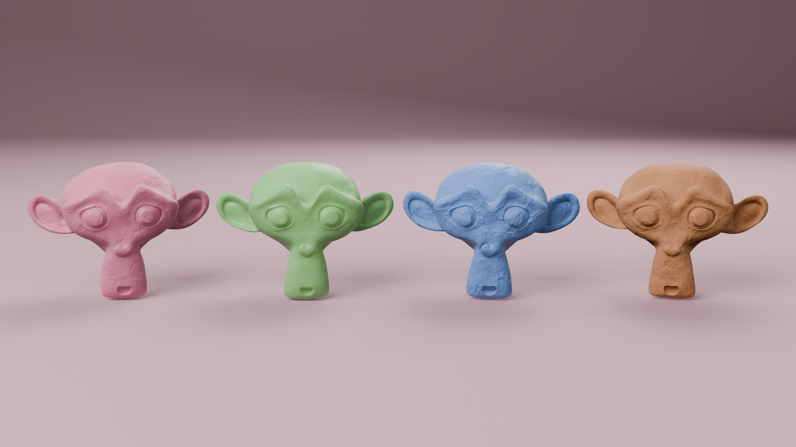
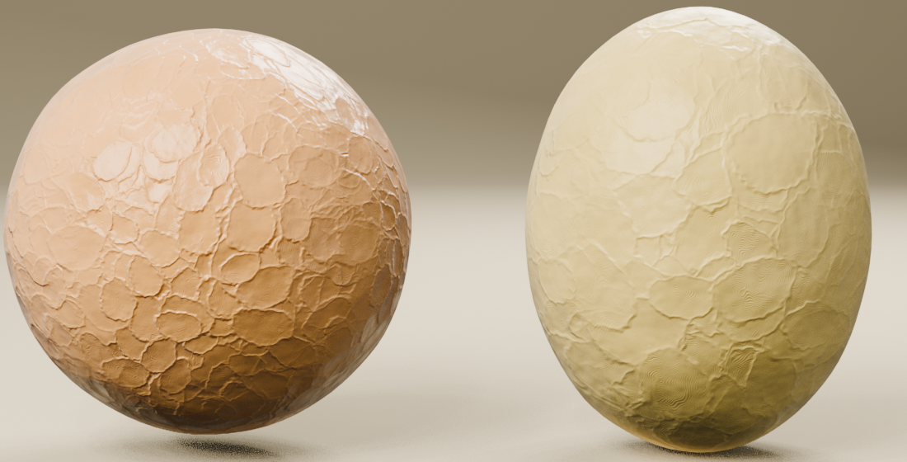
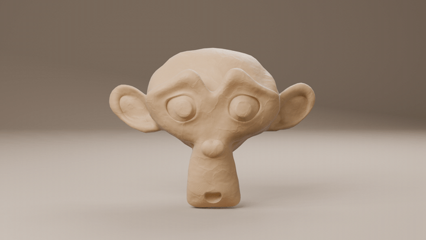

# Procedural Clay for Blender

Free Blender add-on that turns any object into handmade plasticine: a procedural clay material, fingerprints, a shape deformer and a stop-motion "boil". No UV unwrapping. Built for EEVEE, also works in Cycles.

## Features

- **UV-free material**: object-space Noise + Voronoi drive soft lumps, pores and grain, with color variation and roughness breakup.
- **Fingerprints**: overlapping finger presses with raised rims and ridge patterns. Rims read at any distance, ridges up close. You can load your own texture.
- **Clay Deform** (Geometry Nodes): makes the silhouette lumpy, not just the shading. Adaptive subdivision, crease-safe.
- **Sticky**: textures and lumps stay glued to the surface under armatures and shape keys.
- **Stop Motion**: hold poses on 2s/3s, surface "boil" between poses, one-click stepped animation. Keeps working when the .blend is rendered without the add-on (render farms).
- **Presets**: Play-Doh, Smooth Clay, Plasticine, Dry Clay.
- **Studio Setup**: seamless backdrop, soft 3-light rig, DOF camera and EEVEE settings in one click.
- **Draft / Final**: a responsive viewport while you work, full quality when you render.

## Install

**Blender 4.2 and newer (recommended):** download `procedural_clay-<version>.zip` from [Releases](../../releases), then drag it into Blender, or *Edit > Preferences > Get Extensions > ▾ > Install from Disk*.

## Usage

1. Select one or more objects.
2. Sidebar (`N`) > **Clay** > **Apply Clay**.
3. Pick a **Preset**, then fine-tune the sliders.
4. Optional: **Studio Setup**, then look through the camera (`Numpad 0`).
5. Work in **Draft**; switch to **Final** before rendering.

Tips:
- Apply the object's scale (`Ctrl+A` > Scale): object coordinates ignore it, so an unapplied non-uniform scale stretches the pattern.
- Detail reads best with a low-angle light.
- Edit shape values from the Clay tab, not the Modifiers panel, so the sliders stay in sync.
- Stop motion: render only the held poses (Output > Frame Step = Hold Frames), then rebuild the video with ffmpeg, e.g. for hold 3: `ffmpeg -pattern_type glob -framerate 8 -i '*.png' -vf fps=24 clay.mp4`.

## Tested on

- Blender 5.2 (Linux, AMD integrated GPU) by the author.
- Blender 5.0, headless automated tests (material, deform, stop motion, extension install).
- Minimum version is 4.2, but 4.x has not been re-tested recently.

Not yet tested on Windows, macOS or NVIDIA. Reports welcome in [Issues](../../issues).

## Known limitations

- Designed for EEVEE. Cycles works, but the look was tuned in EEVEE.
- Fingerprint ridges are only visible up close (by design: they fade instead of flickering). The dents and rims carry the effect at a distance.
- The first Apply Clay per machine generates the fingerprint texture (~10 s, one time).
- Very heavy scenes on integrated GPUs: stay in Draft, and render from the command line (`blender -b file.blend -a`).

## How it works

| Layer | Source | Drives |
|---|---|---|
| Lumps | Noise 3D, low frequency | Bump (Imperfection), color tint, cavity |
| Pores | Voronoi 3D F1, ~half the cells | Bump (Grain Intensity), cavity, roughness |
| Grain | Noise 3D, high frequency | Bump (Grain Intensity), roughness |
| Fingerprints | Generated 2048 tileable height map, box projection | Press/rim bump, ridge bump, roughness |
| Shape | Noise 3D on rest-pose positions (Geometry Nodes), adaptive subdivision | Offset along blurred normals |
| Boil | New noise lookup per held pose | Shape offset, texture offset |

## Build

`scripts/build_extension.sh [path/to/blender]` validates the manifest and writes the extension zip to `dist/`.

`blender -b --python scripts/showcase.py -- <output dir>` re-renders the images in this README (add `--fast` for a quick preview).

## License

GPL-3.0-or-later. See [LICENSE](LICENSE). See [CHANGELOG.md](CHANGELOG.md) for version history.
