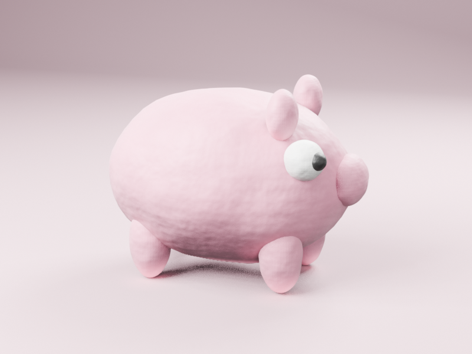
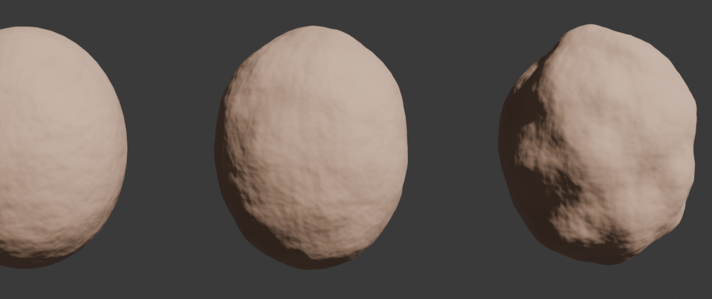

# Procedural Clay for Blender

Blender add-on that turns any object into handmade plasticine: a procedural clay material plus an optional shape deformation. No UV unwrapping needed. Tuned for EEVEE, also works in Cycles.

## Features

- **UV-free material**: Object-coordinate Noise + Voronoi drive three chained bumps (soft lumps, pores, fine grain), color tint and roughness breakup.
- **Fingerprints**: generated, tileable smudge map with real ridge patterns, box-projected (no UVs), mipmapped so it doesn't flicker. You can load your own.
- **Cavity**: dents, pores and grain also darken the albedo, so the detail stays visible under EEVEE's flat lighting.
- **Clay Deform modifier** (Geometry Nodes): makes the silhouette lumpy, not just the shading. Lumps are relative to the object's size and biased inward, so the overall shape is preserved.
- **Sticky**: textures and lumps stay glued to the surface when an armature or shape keys deform the mesh.
- **Stop Motion**: poses held on 2s/3s, surface "boil" between poses, one-click stepped animation.
- **Sidebar panel** (`N` > Clay): Clay Color, Roughness, Grain Intensity, Imperfection, Deformation, plus a Detail subpanel with scales, pores, seed, etc.
- **Presets**: Play-Doh, Smooth Clay, Plasticine, Dry Clay.
- **Studio Setup**: seamless backdrop, soft 3-light rig, DOF camera and EEVEE settings in one click.
- **EEVEE Only**: just the render settings (ray tracing, horizon-scan AO, soft shadows).

## Requirements

Blender 4.2+ (tested on 5.0 and 5.2).

## Install

1. Download `procedural_clay.py`.
2. Blender > Edit > Preferences > Add-ons > ▾ > **Install from Disk…** and pick the file.
3. Enable **Procedural Clay**.

## Usage

1. Select one or more objects.
2. Sidebar (`N`) > **Clay** > **Apply Clay**.
3. Switch the viewport to Material Preview or Rendered.
4. Pick a **Preset**, then fine-tune.
5. Optional: select the model and press **Studio Setup**, then look through the camera (Numpad 0).

Tips:
- Apply the object's scale (`Ctrl+A` > Scale): Object coordinates ignore it, so an unapplied non-uniform scale stretches the pattern.
- Detail reads best with a low-angle light.
- Edit shape values from the Clay tab, not the Modifiers panel, so the sliders stay in sync.

## How it works

| Layer | Source | Drives |
|---|---|---|
| Lumps | Noise 3D, low frequency | Bump (Imperfection), color tint, cavity |
| Pores | Voronoi 3D F1, ~half the cells | Bump (Grain Intensity), cavity, roughness |
| Grain | Noise 3D, high frequency | Bump (Grain Intensity), roughness |
| Fingerprints | Generated 2048 tileable image, box projection | Bump, lower roughness, slight cavity |
| Shape | Noise 3D on vertex positions (Geometry Nodes), adaptive subdivision | Offset along blurred normals |

Bump distances scale with 1 / frequency, so changing a scale changes feature size without changing how strong it looks.

See [CHANGELOG.md](CHANGELOG.md) for version history.
